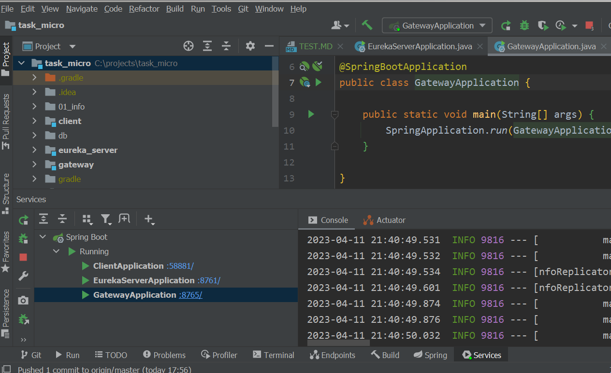
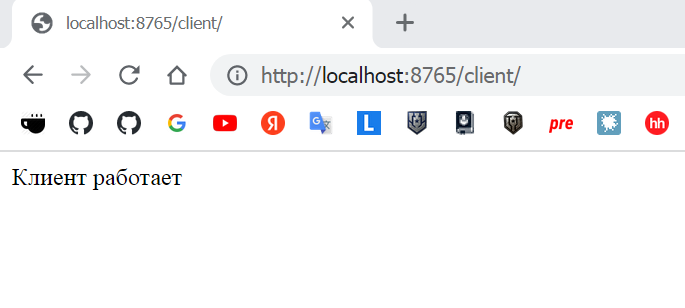
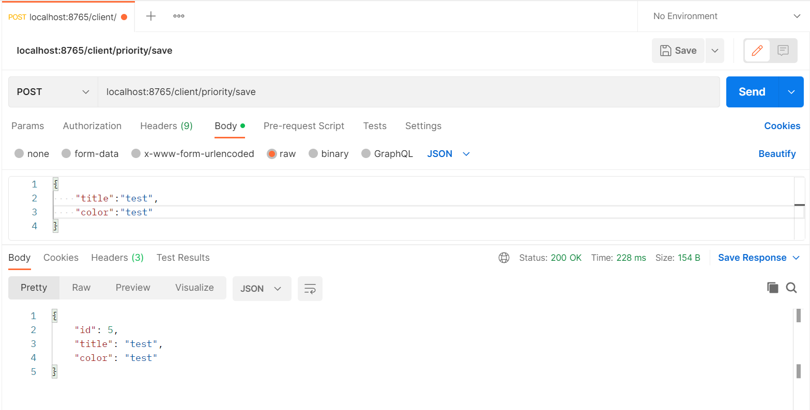
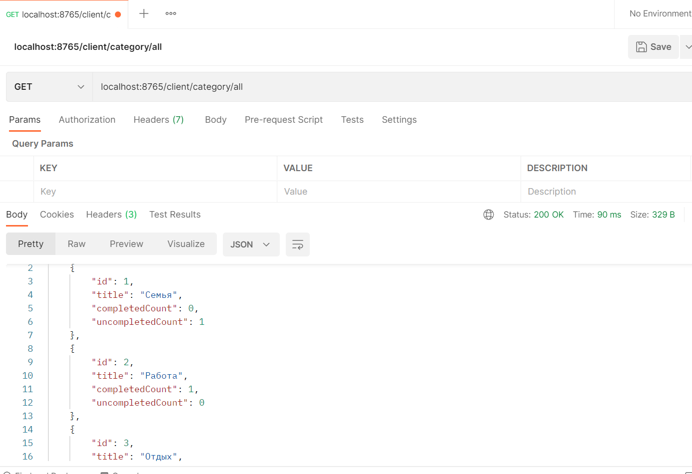
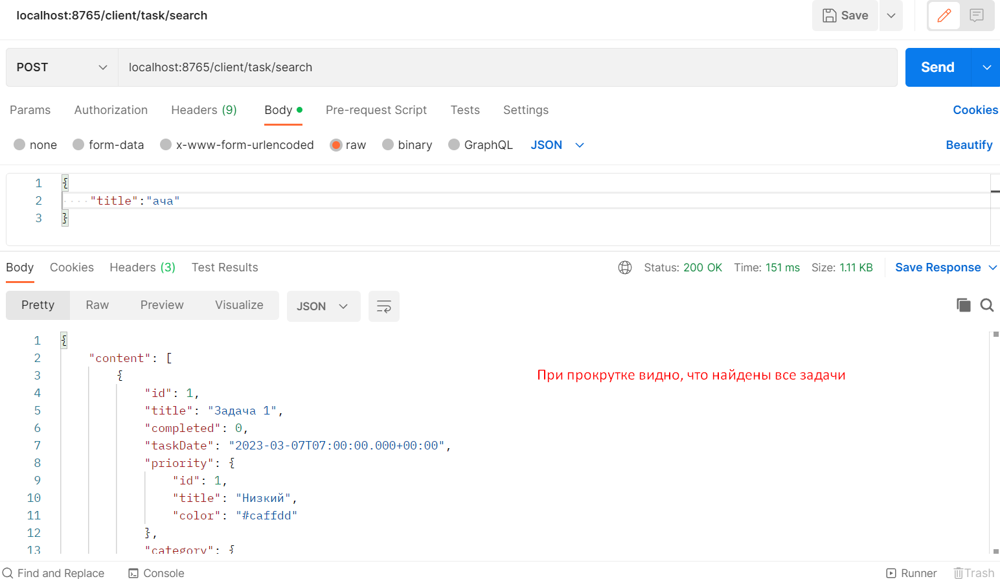

<a href="/README.md">вернуться к оглавлению</a>

Выборочное тестирование проекта проводим с помощью программы Postman  
(скрины результатов в этой папке)  

Для того, чтобы протестировать работоспособность проекта с микросервисами 
нужно сначала запустить его в правильном порядке  

Один из вариантов запуска модулей-сервисов - открываем вкладку
Services  
View > Tool Windows > Services 

Add service > Run Configuration Type > Spring Boot  
Выбираем те модули, которые нужно запускать и запускаем. 
Другой вариант - через запуск main в соответствующих классах.

Примерный порядок запуска модулей  
Первым запускается конфигурационный сервер (в нашем проекте его нет) 
Он нужен, чтобы все остальные модули (сервисы) получили свои настройки, 
если они хранятся во внеших файлах. 
(в нашем проекте все сервисы хранят свои настройки у себя)  

Далее запускаем сервер - в нашем случае eureka_server -
это контейнер (реестр) для остальных сервисов  

Далее запускаются сервисы клиенты - в нашем случае это
Client  

Далее запускается Gateway, через который мы будем
вызывать микросервисы (не напрямую сервисы) - это
шлюз, через который должны обращаться все клиенты    

Если все запустилось без ошибок вы должны увидеть примерно такую картинку. 

services.png

Запросы.  

В отличии от работы с Рест сервисом напрямую,  
где мы делали запросы такого вида:  
Запрос: POST localhost:8080/priority/save  
здесь мы должны обратиться к шлюзу (порт будет другой)  
и через него уже к сервису, примерно так: 
localhost ... порт шлюза ... сервис ...  суть запроса   

~ Сделаем для начала общий запрос к тестовому контроллеру,  
можно через Postman, можно через браузер.  
Запрос: GET localhost:8765/client/

test-gateway-client.png

далее выборочно проверям другие возможности программы

~ Запрос POST localhost:8765/client/priority/save  

priority_save.png

~ Запрос GET localhost:8765/client/category/all

category_all.png

~ Поиск по задачам
Запрос POST localhost:8765/client/task/search

task_search.png

Таким образом делая одинаковые запросы
можно убедиться, что микросервис может выполнять 
те же команды, что и монолит 